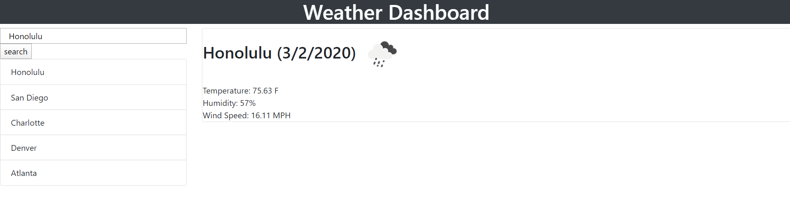

# Weather-Dashboard

The user is able to search for a city and find information regarding the weather in that particular city. The city that was searched will then be shown in a list of searched cities. When the city is searched, the current date, icon for climate, temperature, humidity, wind speed, and UV Index will be shown on the screen. Additionally, the five-day forecast will pop up at the bottom. 

